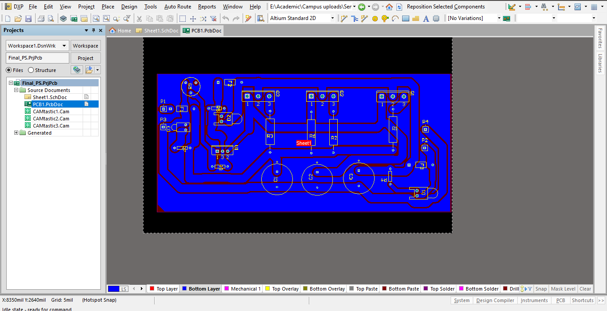

# Constant-Voltage-Power-Supply (7V)

This is a 7V constant valtage power supply implemented without using any kind of switching mechanism. Mechanism of this power supply is based on thermal equilibrium of a bjt transistor. Mainly TIP2955 power transistors are used to controll current through the load. Wattage of the power supply circuit about 70W. Input of the system is a DC voltage and output is 7V. LM317 is used as a voltage regulator for staying 7V at the output. All the current through the load is managed by three transistors with their equilibrium positions. All the PCB related designs are done with [Altium Designer]() platform.

## Schematic Diagram 

## PCB Layout

## Ready for Testing

